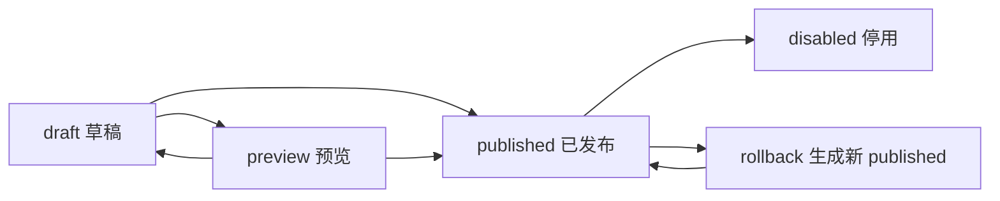

# Page Schema v1 契约

## 状态

ready

## 提供方

- `@meumall/lowcode-schema`
- `@meumall/lowcode-editor`
- Java 配置平台

## 消费方

- `@meumall/lowcode-editor`
- `@meumall/lowcode-core`
- `@meumall/lowcode-renderer-h5`
- `@meumall/lowcode-renderer-vue-h5`
- `@meumall/lowcode-adapters`
- Java 配置平台
- 后续 H5 接入方和小程序渲染器

## 适用环境

- 本地编辑器
- 编辑器实时预览
- Java 配置平台草稿、预览、发布和回滚
- H5 线上运行时
- 后续小程序运行时

## 版本策略

- 当前版本：`1.0.0`
- `schemaVersion` 主版本一致时认为协议兼容，例如 `1.0.0` 与 `1.9.0` 兼容，`2.0.0` 不兼容。
- `pageVersion` 是页面内容版本，由编辑器或 Java 配置平台递增；不代表协议版本。
- 新增可选字段为兼容变更。
- 新增枚举值需先确认所有消费者具备 fallback。
- 删除字段、修改字段类型、收紧已发布字段语义、改变运行时渲染或发布语义均为不兼容变更，必须提供 migration 或 v2 协议。

## 核心结构

Page Schema 必须是 JSON 可序列化对象。TypeScript 定义由 `packages/schema/src/index.ts` 维护，当前 v1 核心结构如下：

```ts
interface LowcodePageSchema {
  schemaVersion: string;
  pageId: string;
  pageVersion: string;
  title: string;
  status: "draft" | "preview" | "published" | "disabled";
  pageType?: "activity" | "promotion" | "topic" | "landing" | "custom";
  description?: string;
  targetPlatforms: Array<"h5" | "miniapp">;
  theme?: LowcodeThemeConfig;
  layout: LowcodeLayoutConfig;
  nodes: LowcodeNode[];
  dataSources?: LowcodeDataSourceConfig[];
  actions?: LowcodeActionConfig[];
  tracking?: LowcodeTrackingConfig;
  publishMeta: LowcodePublishMeta;
  editor?: LowcodeEditorMeta;
}
```

## 字段语义

### 顶层字段

| 字段 | 必填 | 语义 | 生产方 | 消费方 |
| --- | --- | --- | --- | --- |
| `schemaVersion` | 是 | Page Schema 协议版本。当前固定输出 `1.0.0`。消费者按主版本判断兼容性。 | schema/editor/Java | 全部消费者 |
| `pageId` | 是 | 页面稳定业务标识。同一个活动页、专题页或落地页的草稿、预览、发布版本应保持一致。 | editor/Java | Java/H5/runtime |
| `pageVersion` | 是 | 页面内容版本，默认 `0.1.0`。每次发布或回滚生成新 release 时建议递增。 | editor/Java | Java/H5/审计 |
| `title` | 是 | 页面标题，用于编辑器、版本列表、运行时 document title 或分享标题 fallback。 | editor/Java | editor/H5 |
| `status` | 是 | 页面生命周期：`draft` 草稿、`preview` 预览、`published` 已发布、`disabled` 停用。 | editor/Java | editor/H5/Java |
| `pageType` | 否 | 页面业务类型：活动、推广、专题、落地页或自定义。默认 `custom`。 | editor/Java | editor/Java/统计 |
| `description` | 否 | 页面描述，不参与渲染主链路，可用于运营备注、搜索和审计。 | editor/Java | editor/Java |
| `targetPlatforms` | 是 | 页面目标平台，当前允许 `h5`、`miniapp`。默认 `["h5"]`。 | editor/Java | renderer/Java |
| `theme` | 否 | 页面级设计 token 和明暗模式配置。renderer 可按需消费，未知 token 必须忽略。 | editor/design system | renderer/materials |
| `layout` | 是 | 页面级布局配置。默认 `{ safeArea: true }`。 | editor | renderer |
| `nodes` | 是 | 页面节点树，根节点数组按顺序渲染。 | editor | renderer/core/Java |
| `dataSources` | 否 | 页面级数据源声明，只描述数据需求，不直接发起请求。 | editor/Java | adapters/runtime |
| `actions` | 否 | 页面级动作白名单，节点事件只能引用这里声明的 action。 | editor/Java | adapters/runtime |
| `tracking` | 否 | 页面级埋点配置。缺省时 runtime 可以使用宿主默认埋点策略。 | editor/Java | H5/埋点 |
| `publishMeta` | 是 | 发布环境、发布时间、回滚来源和操作人。默认环境为 `test`。 | editor/Java | Java/H5/审计 |
| `editor` | 否 | 编辑器私有状态，例如画布宽度、最后选中节点、备注。运行时不得依赖该字段。 | editor | editor |

### `layout`

| 字段 | 语义 |
| --- | --- |
| `maxWidth` | 页面内容最大宽度，H5 可用于居中或移动端安全宽度约束。 |
| `backgroundColor` | 页面背景色。必须是 renderer 可直接使用的 CSS color 字符串。 |
| `backgroundImage` | 页面背景图 URL。正式发布前应由素材中心或 CDN 产出稳定地址。 |
| `safeArea` | 是否启用底部或顶部安全区。H5 默认 `true`。 |

### `theme`

| 字段 | 语义 |
| --- | --- |
| `tokens` | 页面级设计 token，例如品牌色、圆角、间距。key/value 都必须是字符串。 |
| `mode` | 主题模式，当前推荐 `light` 或 `dark`，允许保留自定义字符串给业务扩展。 |

### `nodes`

节点是 renderer 的最小渲染单位：

```ts
interface LowcodeNode {
  id: string;
  componentName: string;
  materialVersion: string;
  props: JsonObject;
  style?: JsonObject;
  slot?: string;
  children?: LowcodeNode[];
  dataBinding?: Record<string, string>;
  events?: Record<string, { actionId: string; params?: JsonObject }>;
  visibility?: LowcodeVisibilityRule;
  responsive?: LowcodeResponsiveRule[];
  meta?: LowcodeNodeMeta;
}
```

| 字段 | 必填 | 语义 |
| --- | --- | --- |
| `id` | 是 | 节点稳定唯一 ID。整棵树内必须唯一，发布后不得因普通属性编辑无意义改变。 |
| `componentName` | 是 | 物料组件名，必须能在目标平台物料 registry 或 manifest 中找到。 |
| `materialVersion` | 是 | 节点创建或最后确认使用的物料版本。renderer 可用该值做兼容提示，实际注册仍以宿主物料包为准。 |
| `props` | 是 | 物料静态属性，只允许 JSON 值。字段含义由对应 Material Manifest 定义。 |
| `style` | 否 | 节点外层或物料约定的样式对象，只允许 JSON 值。renderer 可按平台策略过滤不支持的样式。 |
| `slot` | 否 | 当前节点挂载到父物料的命名插槽。无 slot 时按默认内容区处理。 |
| `children` | 否 | 子节点数组。容器物料才应携带子节点；非容器物料的 children 应在发布前被拦截。 |
| `dataBinding` | 否 | 将 `props` 字段绑定到 runtime data path，例如 `{ items: "products.items" }`。绑定命中时覆盖同名静态 props。 |
| `events` | 否 | 事件到 action 的引用表。eventName 必须来自 Material Manifest，actionId 必须存在于 `actions`。 |
| `visibility` | 否 | 节点显示规则。`static` 用固定布尔值，`data` 用 path/equals 判断 runtime data。 |
| `responsive` | 否 | 平台或宽度响应式覆盖。只允许声明 `h5` 或 `miniapp`。 |
| `meta` | 否 | 编辑器辅助信息，运行时不得依赖。 |

### `visibility`

| 字段 | 语义 |
| --- | --- |
| `source` | `static` 或 `data`。 |
| `value` | `source=static` 时使用的固定布尔值。 |
| `path` | `source=data` 时读取 runtime data 的路径。 |
| `equals` | `source=data` 时的比较目标；缺省时由 runtime 自行定义 truthy 策略。 |

### `responsive`

| 字段 | 语义 |
| --- | --- |
| `platform` | 规则生效平台，只能是 `h5` 或 `miniapp`。 |
| `minWidth` / `maxWidth` | H5 宽度条件。小程序可忽略或转换为宿主规则。 |
| `props` | 命中规则后覆盖到节点 props 的 JSON 对象。 |
| `style` | 命中规则后覆盖到节点 style 的 JSON 对象。 |

### `dataSources`

```ts
interface LowcodeDataSourceConfig {
  id: string;
  type: string;
  params?: JsonObject;
  bindTo?: string;
  cache?: {
    ttlSeconds?: number;
    scope?: "public" | "private";
  };
}
```

| 字段 | 必填 | 语义 |
| --- | --- | --- |
| `id` | 是 | 数据源唯一 ID。页面内不得重复。 |
| `type` | 是 | 数据源类型，例如 `mock`、`http`、`product.search`。真实可用类型由 runtime handler 白名单决定。 |
| `params` | 否 | 数据源参数，只允许 JSON 对象，不允许函数或运行时代码。 |
| `bindTo` | 否 | 解析结果写入 renderer data 的路径。缺省可使用 `id`。 |
| `cache` | 否 | 缓存建议。`public` 可跨用户复用，`private` 必须按用户或会话隔离。 |

### `actions`

```ts
interface LowcodeActionConfig {
  id: string;
  type: string;
  params?: JsonObject;
}
```

| 字段 | 必填 | 语义 |
| --- | --- | --- |
| `id` | 是 | action 唯一 ID。页面内不得重复。 |
| `type` | 是 | 动作类型，例如 `navigate`、`coupon.receive`、`tracking.click`、`noop`。真实可用类型由 runtime handler 白名单决定。 |
| `params` | 否 | 动作参数，只允许 JSON 对象。不得包含可执行脚本。 |

### `tracking`

| 字段 | 语义 |
| --- | --- |
| `pageName` | 页面埋点名。缺省时可使用 `pageId`。 |
| `channelParamKeys` | 需要从 URL 或宿主上下文透传的渠道参数 key。 |
| `exposure` | 是否开启页面或节点曝光。 |
| `click` | 是否开启点击埋点。 |

### `publishMeta`

| 字段 | 必填 | 语义 |
| --- | --- | --- |
| `environment` | 是 | 发布环境：`test`、`pre`、`prod`。 |
| `publishedAt` | 否 | 发布时间，建议使用 ISO 8601 字符串。 |
| `rollbackVersion` | 否 | 如果当前版本来自回滚，记录来源 `pageVersion` 或 release version。 |
| `operator` | 否 | 操作人标识，建议由 Java 配置平台写入可信账号。 |

### `editor`

| 字段 | 语义 |
| --- | --- |
| `canvasWidth` | 编辑器画布宽度。 |
| `lastSelectedNodeId` | 最后选中的节点 ID。 |
| `notes` | 编辑备注。 |

## 输出格式

- 编辑器必须输出完整 `LowcodePageSchema`，并调用 `validateLowcodePageSchema` 做基础结构校验。
- Java 配置平台存储时不得丢失未知的兼容可选字段，尤其是未来 minor 版本新增字段。
- Java 配置平台发布 `prod` 时必须冻结当次 schema 快照，并生成可追溯 release。
- H5 runtime 默认只消费 `status=published` 的 schema；预览链路必须带 previewId、previewToken 或等价上下文明确允许。
- renderer 遇到未知 `componentName` 时应降级展示空节点、错误占位或跳过，并上报诊断；不得导致整页白屏。

## 错误格式

`validateLowcodePageSchema` 返回：

```ts
interface LowcodeValidationResult {
  valid: boolean;
  errors: string[];
}
```

`assertLowcodePageSchema` 校验失败时抛出 `Error`。

## 校验规则

基础校验由 `validateLowcodePageSchema` 提供，必须覆盖：

- schema 必须是对象。
- `schemaVersion`、`pageId`、`pageVersion`、`title` 必须是非空字符串。
- `status` 只能是 `draft`、`preview`、`published` 或 `disabled`。
- `pageType` 只能是 `activity`、`promotion`、`topic`、`landing` 或 `custom`。
- `targetPlatforms` 必须是非空数组，且元素只能是 `h5` 或 `miniapp`。
- `layout` 必须是对象。
- `nodes` 必须是数组。
- `publishMeta.environment` 必须存在。
- 节点 `id` 在整棵树内必须唯一。
- 节点 `componentName`、`materialVersion` 必须是非空字符串。
- 节点 `props` 必须是对象；`style` 如果存在也必须是对象。
- `events.*.actionId` 必须引用已声明 action。
- `actions.id` 和 `dataSources.id` 不能重复。
- `visibility.source` 只能是 `static` 或 `data`。
- `responsive[].platform` 只能是 `h5` 或 `miniapp`。

发布前增强校验由编辑器和 Java 配置平台共同完成，至少应覆盖：

- `componentName` 必须存在于目标平台物料 manifest。
- `materialVersion` 必须满足当前物料包兼容策略。
- 节点 props 必须满足 Material Manifest 的 `propsSchema` 必填、类型和 setter 值域。
- 只有容器物料可以携带 `children`，且 slot 必须符合父物料支持的插槽。
- 节点 `events` 的 eventName 必须存在于 Material Manifest。
- `actions.type` 和 `dataSources.type` 必须存在于环境白名单。
- `status=published` 且 `publishMeta.environment=prod` 时，图片、商品、优惠券、门店、达人、活动规则等业务资源必须通过可用性校验。

## 生命周期



- `draft`：运营编辑中，可保存未完全满足发布条件的 schema。
- `preview`：用于预览链路，允许短期访问，不能作为线上 active schema。
- `published`：线上 runtime 可消费的稳定 schema。
- `disabled`：Java 配置平台可保留但 H5 runtime 不应渲染为正常页面。
- 回滚不修改历史 release，而是基于历史 schema 生成新的 published release，并写入 `publishMeta.rollbackVersion`。

## 兼容性要求

- `schemaVersion` 主版本兼容是最低门槛，不代表业务一定可发布；仍需物料、数据源和 action 白名单校验。
- v1 minor 版本新增的可选字段，旧 renderer 必须可忽略。
- v1 patch 版本只能修复文档、校验或兼容 bug，不应改变已发布字段语义。
- `componentName` 一旦发布，不得随意改名；确需改名时必须在物料 registry 或 migration 中保留别名。
- `props` 字段改名、删除或类型变更会影响已发布 schema，必须提供 migration 或在物料内兼容旧字段。
- `dataSources.type`、`actions.type` 的新增必须先在 runtime handler 白名单中上线，再允许编辑器配置。
- 物料是否支持某平台以 `LowcodeMaterialManifest.platforms` 为准；Page Schema 声明 `miniapp` 不代表所有节点都可在小程序运行。
- Java 配置平台不得对未知兼容字段做破坏性裁剪，除非该字段属于明确的服务端禁用名单。

## 安全要求

- schema、props、dataSources.params、actions.params 均不得包含函数、表达式或任意脚本字符串作为可执行代码。
- H5 runtime 只能通过白名单 handler 执行 action 和 data source，不得按 schema 动态执行代码。
- URL、图片、富文本、跳转参数和业务资源 ID 必须在编辑器或发布服务做安全过滤。
- `editor` 和 `meta` 字段不得携带敏感用户信息、token、cookie 或内部权限数据。

## 测试方式

- `pnpm typecheck`
- `pnpm build`
- `pnpm test`
- `packages/schema/test/schema.test.mjs` 覆盖默认值、递归节点、重复 ID、action 引用、manifest 校验和版本兼容。
- editor 和 H5 runtime smoke check 需分别访问 `http://127.0.0.1:5173/` 与 `http://127.0.0.1:5174/`。

## 变更流程

1. 创建或更新任务。
2. 更新本契约。
3. 更新 `packages/schema` 类型和校验。
4. 更新受影响包、renderer、editor、adapters、Java API 草案和 README。
5. 如字段影响已发布页面，补充 migration 或兼容 adapter。
6. 运行验证并记录结果。
7. 提交信息必须使用中文。

## 回滚方式

- npm 发布前：回滚提交。
- npm 发布后：发布 patch/minor 修复版本；不兼容变更需要恢复兼容字段或提供 migration。
- Java 配置平台发布后：回滚 active release 到上一版 published schema，或基于历史 release 生成新 published release。
- H5 runtime 发现不兼容 schema：按 runtime loader fallback 策略降级到 fallback schema 或错误页，并上报 `schemaVersion`、`pageId`、`pageVersion` 和 releaseId。
